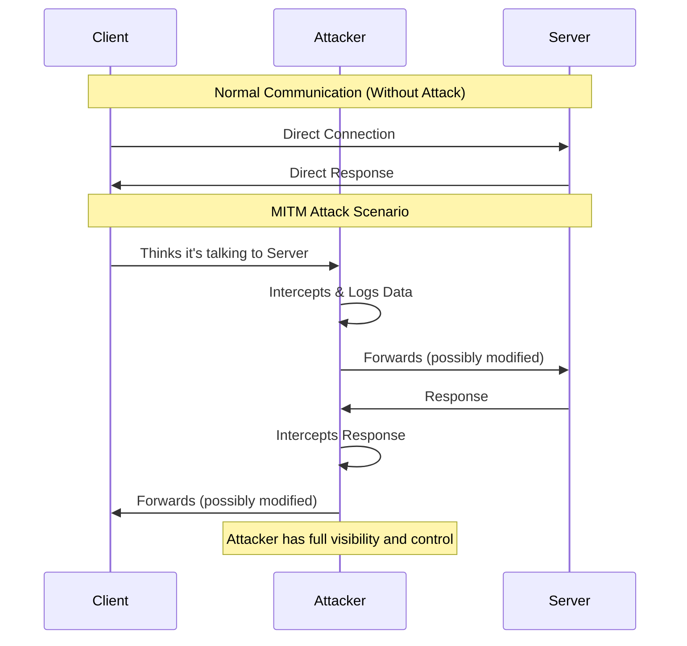

# 🔐 MITM Attack Demonstration System

## 🏥 Hospital Patient Portal Demo

**Experience a realistic MITM attack scenario!** The new Hospital Patient Portal demonstrates how sensitive medical data can be intercepted when proper encryption is not used. This GUI-based demo shows:

- 🏥 Professional hospital login interface
- 📋 Patient health information form (medical conditions, medications, allergies, etc.)
- 🚨 Real-time interception of sensitive health data by MITM attacker
- 🔒 Protection demonstration with encryption enabled

**Quick Start Hospital Demo:**
```bash
run_hospital_demo.bat
```

## 📋 Table of Contents

- [Overview](#overview)
- [System Architecture](#system-architecture)
- [Components](#components)
- [Quick Start](#quick-start)
- [Security Lessons](#security-lessons)
- [Project Structure](#project-structure)
- [Technologies Used](#technologies-used)


## 🎯 Overview

This system demonstrates MITM attacks through three main components:

1. **Legitimate Server** - Handles client authentication and data processing
2. **Client Application** - Sends requests to the server
3. **MITM Attacker/Proxy** - Intercepts traffic between client and server

### Attack Flow



## 🏗️ System Architecture

```
┌─────────────────────────────────────────────────────────────┐
│                    Web Control Panel                         │
│                   (http://localhost:4567)                    │
│  ┌──────────────┐  ┌──────────────┐  ┌──────────────┐      │
│  │   Server     │  │  MITM Proxy  │  │    Logs      │      │
│  │   Control    │  │   Control    │  │  & Stats     │      │
│  └──────────────┘  └──────────────┘  └──────────────┘      │
└─────────────────────────────────────────────────────────────┘
                              │
        ┌─────────────────────┼─────────────────────┐
        │                     │                     │
        ▼                     ▼                     ▼
┌───────────────┐    ┌───────────────┐    ┌───────────────┐
│    Client     │    │ MITM Attacker │    │    Server     │
│  Port: N/A    │◄──►│  Port: 8081   │◄──►│  Port: 8080   │
│               │    │               │    │               │
│ - Login       │    │ - Intercept   │    │ - Auth        │
│ - Send Data   │    │ - Steal Creds │    │ - Process     │
│ - Encryption  │    │ - Modify Msgs │    │ - Respond     │
└───────────────┘    └───────────────┘    └───────────────┘
```

## 🧩 Components

### 1. Server Component
- Listens on port **8080**
- Handles client authentication
- Processes data requests
- Maintains session state
- Logs all transactions

**Demo Users:**
- Username: `alice` | Password: `password123`
- Username: `bob` | Password: `secret456`
- Username: `admin` | Password: `admin789`

### 2. Client Component
- Connects to server (or attacker proxy)
- Sends login credentials
- Transmits data messages
- Supports encryption toggle
- Interactive CLI mode

### 3. MITM Attacker/Proxy
- Listens on port **8081** (pretends to be server)
- Forwards traffic to real server on port **8080**
- Intercepts all bidirectional traffic
- Logs intercepted data
- Can modify messages in transit
- Steals unencrypted credentials


## 🚀 Quick Start

### Prerequisites
- Java JDK 11 or higher
- Maven 3.6+
- Web browser (for control panel)

### Installation

1. **Clone or extract the project**
```bash
cd mitm-attack-demo
```

2. **Build the project**
```bash
mvn clean package
```

3. **Run the web control panel**
```bash
java -jar target/mitm-attack-demo-1.0.0.jar
```


### Alternative: Run Components Separately

**Terminal 1 - Start Server:**
```bash
java -cp target/mitm-attack-demo-1.0.0.jar com.mitm.server.Server
```

**Terminal 2 - Start MITM Proxy:**
```bash
java -cp target/mitm-attack-demo-1.0.0.jar com.mitm.attacker.MITMProxy
```

**Terminal 3 - Run Client (Normal Connection):**
```bash
java -cp target/mitm-attack-demo-1.0.0.jar com.mitm.client.Client localhost 8080
```

**Terminal 3 - Run Client (MITM Attack):**
```bash
java -cp target/mitm-attack-demo-1.0.0.jar com.mitm.client.Client localhost 8081
```


## 📁 Project Structure

```
mitm-attack-demo/
├── src/
│   └── main/
│       ├── java/
│       │   └── com/
│       │       └── mitm/
│       │           ├── Main.java                      # Entry point with web server
│       │           ├── models/
│       │           │   ├── Message.java               # Message model
│       │           │   ├── User.java                  # User model
│       │           │   └── HealthRecord.java          # Health record model (NEW)
│       │           ├── utils/
│       │           │   ├── Logger.java                # Logging utility
│       │           │   ├── MessageEncryptor.java      # Encryption utility
│       │           │   └── NetworkUtils.java          # Network helpers
│       │           ├── server/
│       │           │   └── Server.java                # Legitimate server
│       │           ├── client/
│       │           │   ├── Client.java                # CLI client application
│       │           │   └── HospitalClientGUI.java     # Hospital GUI client (NEW)
│       │           └── attacker/
│       │               └── MITMProxy.java             # MITM attacker
│       └── resources/
│           └── static/
│               ├── css/
│               │   └── style.css                      # Web UI styles
│               └── js/
│                   └── app.js                         # Web UI logic
├── logs/                                              # Log files
├── pom.xml                                            # Maven configuration
├── run_hospital_demo.bat                              # Run hospital demo 
├── run_hospital_client_direct.bat                     # Run client directly
├── README.md                                          # This file
├── SETUP_GUIDE.md                                    # Detailed setup instructions
└── SECURITY_MITIGATION.md                            # Security best practices
```

## 🛠️ Technologies Used

- **Java 11+** - Core programming language
- **Maven** - Build and dependency management
- **Spark Java** - Lightweight web framework
- **Gson** - JSON processing
- **Java Sockets** - Network communication
- **AES Encryption** - Message encryption
- **HTML/CSS/JavaScript** - Web interface
- **SLF4J/Logback** - Logging framework

## 📚 Additional Documentation

- [SETUP_GUIDE.md](SETUP_GUIDE.md) - Detailed installation and configuration
- [SECURITY_MITIGATION.md](SECURITY_MITIGATION.md) - How to prevent MITM attacks
- [JavaDoc](docs/) - API documentation (generate with `mvn javadoc:javadoc`)


